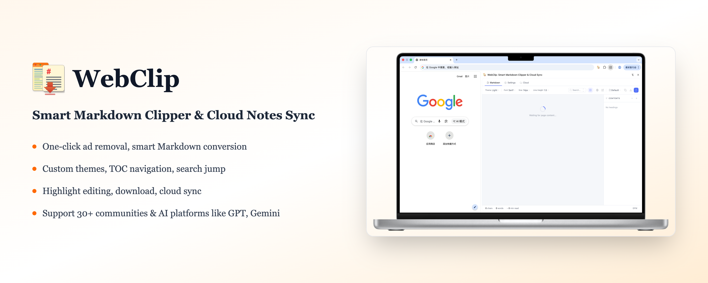
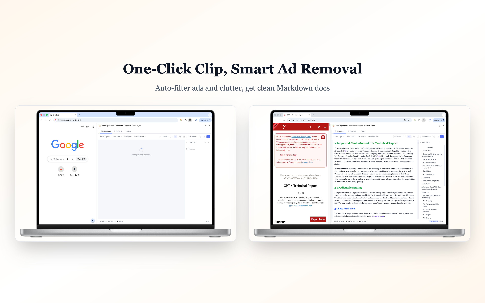
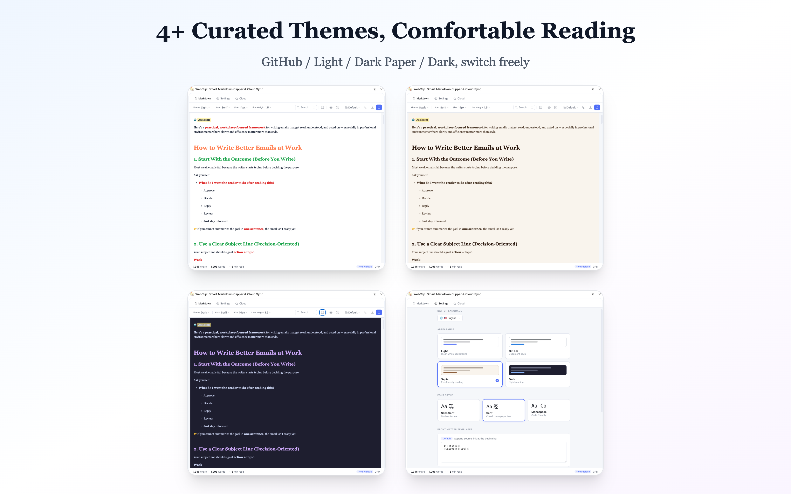
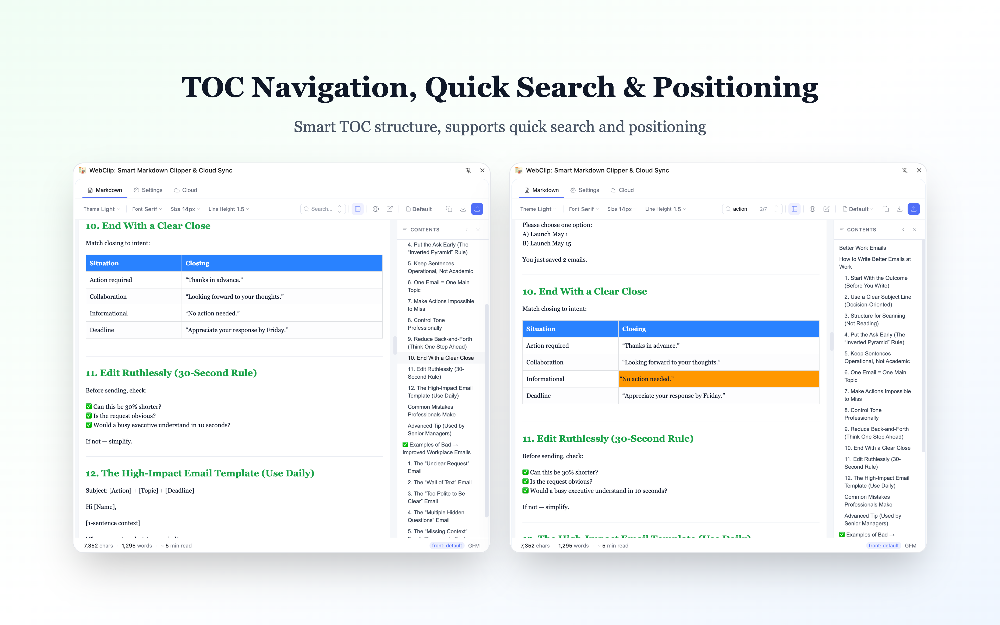
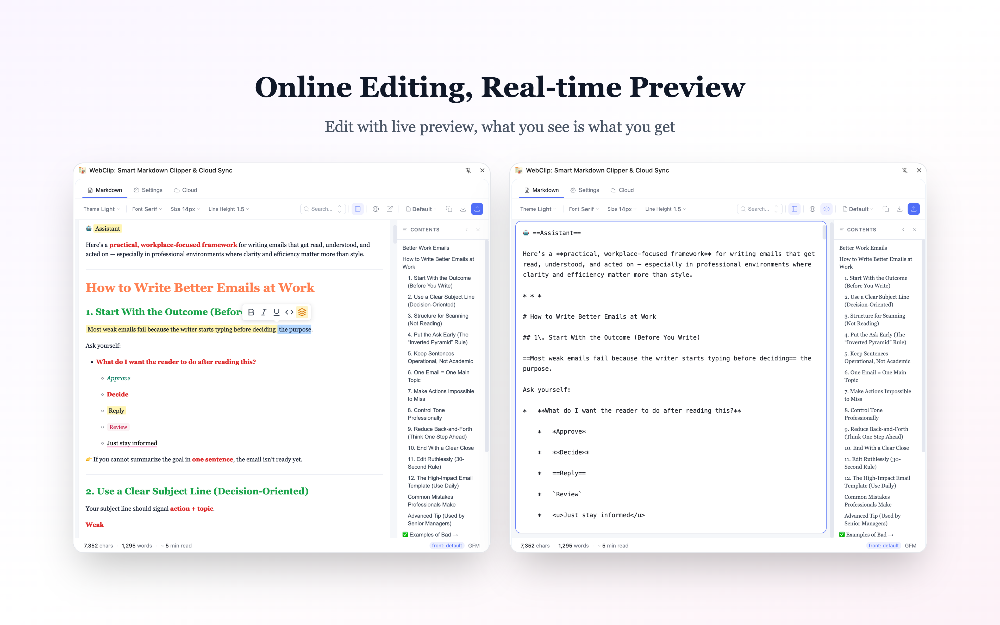
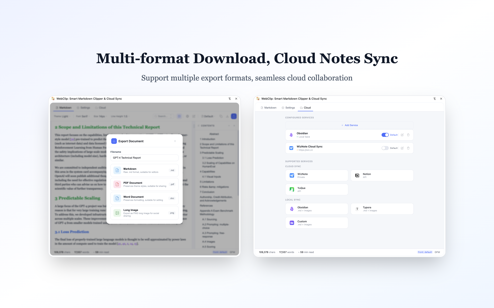

# WebClip : Smart Markdown Clipper & Cloud Sync

  

> One-click remove ads & tags, smart convert to Markdown. Supports custom themes, TOC navigation, search jump, highlight editing, download & cloud sync. Works with 30+ communities and AI platforms.

English | [简体中文](./README_ZH.md)

---

## Features

### Smart Text Extraction

Intelligently identify main content, auto-filter ads, recommendations, comments, and tags. Deeply optimized code block extraction with syntax highlighting preserved.

  

### Personalized Reading Experience

4 beautiful themes (Light, GitHub, Sepia, Dark), 3 font families, adjustable font size and line height for comfortable reading.

  

### Efficient Navigation

Auto-generated table of contents with chapter quick-jump support. Full-text search with highlighted positioning. Collapsible/expandable TOC.

  

### Online Editing

Real-time Markdown editing with instant preview. One-click export to multiple formats.

  

### Multi-Platform Cloud Sync

Seamless integration with WizNote, Notion, Yuque, Obsidian, Typora and more. Multi-format export: Markdown, PDF, Word, Long Image.

  

---

## Supported Platforms

Supports 30+ mainstream tech communities, developer platforms, and AI conversation platforms including both domestic and international services.

---

## Quick Start

### Installation

**Chrome Web Store / Edge Add-ons (Recommended)**

1. Visit [Chrome Web Store](https://chrome.google.com/webstore/detail/webclip) or [Edge Add-ons](https://microsoftedge.microsoft.com/addons/detail/webclip)
2. Search for "WebClip"
3. Click Install

### Usage

1. Click the WebClip icon in browser toolbar
2. Current webpage content is automatically extracted and converted to Markdown
3. Edit, preview and adjust format in the sidebar
4. Copy or save to cloud notes with one click

---

## Privacy Protection

- All processing is done locally, no upload to servers
- No browsing history or personal identity information collected
- Cloud sync only after user active authorization
- See [Privacy Policy](./docs/PRIVACY.md) for details

---

## Changelog

### v2.1.3 (2026-03-26)

- Enhanced AI platform support
- Improved export functionality
- UI/UX optimizations

### v2.1.2 (2026-03-23)

- Multi-format export: Markdown, PDF, Word, Long Image
- PDF smart pagination
- Word export support
- Long image export with Retina resolution

### v2.1.1 (2026-03-23)

- Multi-cloud notes service support
- Local sync with ZIP packaging
- Service adapter pattern
- UI refactoring

### v2.1.0 (2026-03-22)

- Security hardening: Fixed XSS vulnerabilities
- Performance optimization
- TOC improvements
- Cloud notes enhancements
- Search enhancements

### v2.0.0 (2026-03-18)

- New architecture with pluggable preprocessors
- Added support for cloud vendor documentation
- UI optimization with 4 themes and 3 fonts
- Cloud sync support

---

## Contributing

Welcome to submit Issues and Pull Requests.

- [GitHub Issues](https://github.com/damoncui668/webclip/issues)

## License

- [MIT License](./LICENSE)

---

## Support

If WebClip helps you, consider buying me a coffee to support continuous development!

  <table>
    <tr>
      <td align="center">
        
         
        WeChat Pay
      </td>
      <td align="center">
        
         
        Alipay
      </td>
    </tr>
  </table>

---

Make WebClip your knowledge management assistant, build your personal knowledge base with ease!
