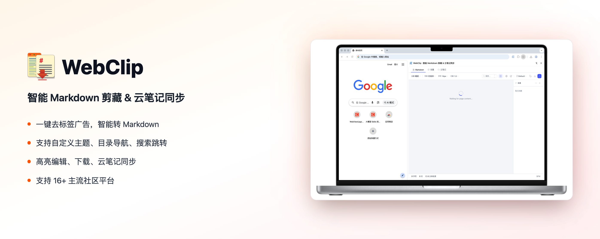
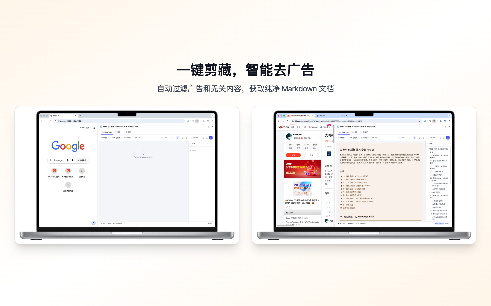
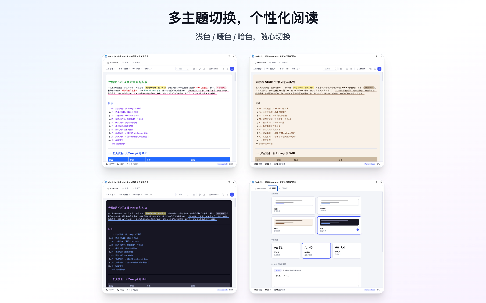
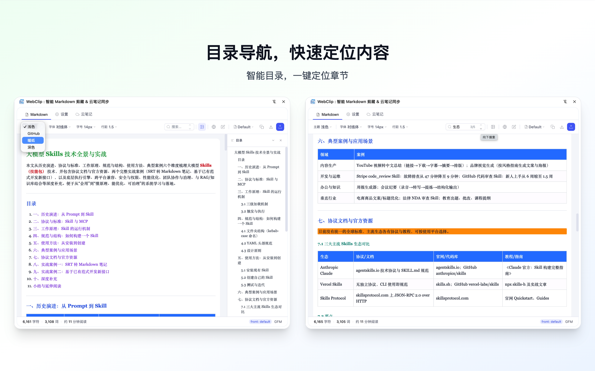
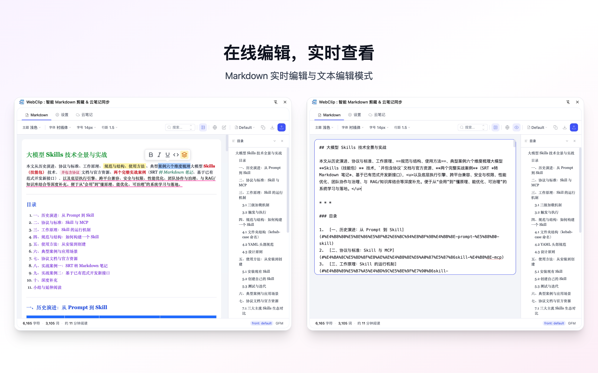
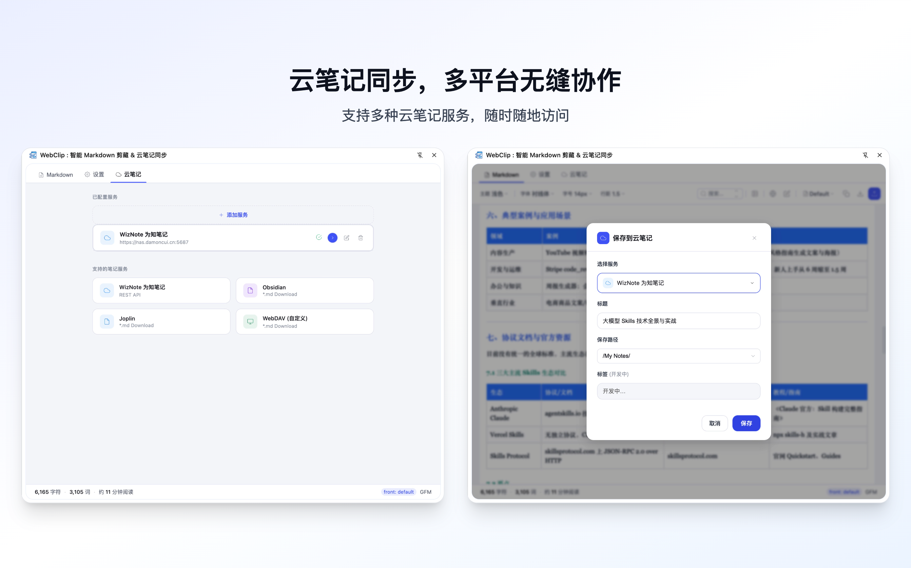

# WebClip : 智能 Markdown 剪藏 & 云笔记同步

  

> 一键去标签广告，智能转 Markdown，支持自定义主题、目录导航、搜索跳转、高亮编辑、下载、云笔记同步，支持16+主流社区平台。

[English](./README_EN.md) | 简体中文

---

## ✨ 功能特性

### 🧠 智能文本提取

基于 Mozilla Readability 引擎，精准识别正文内容，自动过滤广告、推荐、评论、标签等干扰信息，深度优化代码块提取，完整保留语法高亮。

  

### 🎨 个性化阅读体验

支持 4 种精美主题（浅色、GitHub、暖纸、深色），3 种字体可选，可调字号、行距，保护视力舒适阅读。

  

### ⚡ 高效导航

自动生成文章目录，支持章节快速跳转，全文搜索支持高亮定位，目录支持折叠展开。

  

### 🖥️ 在线编辑

支持 Markdown 实时编辑与文本编辑模式，即时预览，一键导出。

  

### 📤 云笔记同步

支持为知笔记等多种云笔记服务，随时随地访问，多平台无缝协作。

  

---

## 🌐 支持的网站

掘金、知乎、CSDN、博客园、简书、SegmentFault、GitHub、51CTO、开源中国、阿里云、腾讯云、华为云、StackOverflow、MDN、微信公众号等

---

## 🚀 快速开始

### 安装

**Chrome Web Store / Edge Add-ons（推荐）**

1. 访问 [Chrome Web Store](https://chrome.google.com/webstore/detail/webclip) 或 [Edge Add-ons](https://microsoftedge.microsoft.com/addons/detail/webclip)
2. 搜索 "WebClip"
3. 点击安装

### 使用

1. 点击浏览器工具栏的 WebClip 图标
2. 当前网页内容自动提取并转换为 Markdown
3. 在侧边栏中编辑、预览和调整格式
4. 一键复制或保存到云笔记

---

## 🔒 隐私保护

- 所有处理在本地完成，不上传服务器
- 不收集浏览历史、个人身份信息
- 云同步仅在用户主动授权后进行
- 详见 [隐私政策](./docs/PRIVACY.md)

---

## 📝 更新日志

### v2.0.0 (2026-03-18)

- 全新架构：重构提取模块，支持可插拔预处理器
- 新增支持：华为云、阿里云、腾讯云等云厂商文档
- 界面优化：新增 4 种主题、3 种字体选择
- 云同步：支持为知笔记等云存储服务

---

## 🤝 贡献

欢迎提交 Issue 和 Pull Request。

- [GitHub Issues](https://github.com/damoncui668/webclip/issues)

## 📄 许可证

- [MIT License](./LICENSE)

---

## ☕ 支持项目

如果 WebClip 对你有帮助，可以请我喝杯咖啡，支持持续开发！

  <table>
    <tr>
      <td align="center">
        
         
        微信支付
      </td>
      <td align="center">
        
         
        支付宝
      </td>
    </tr>
  </table>

---

让 WebClip 成为你的知识管理助手，轻松构建个人知识库！
