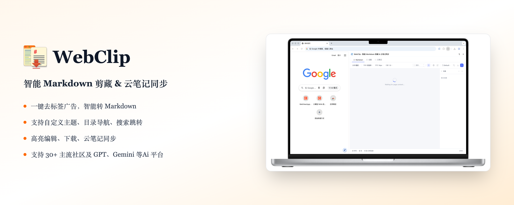
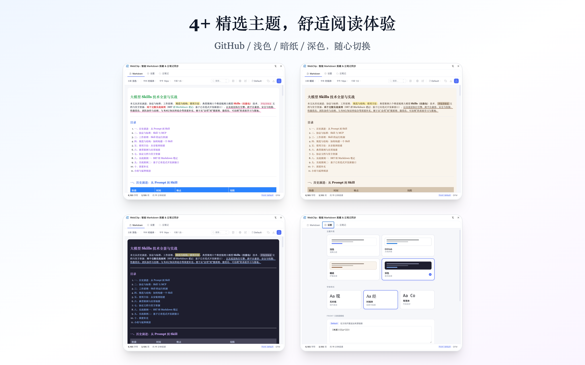
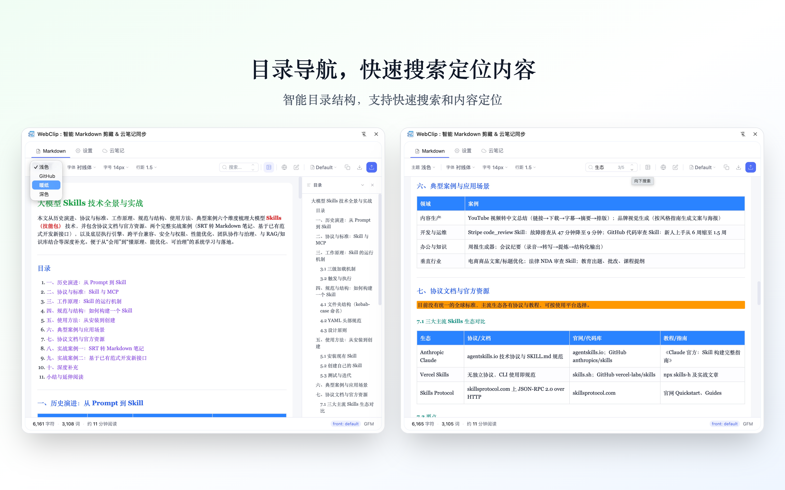
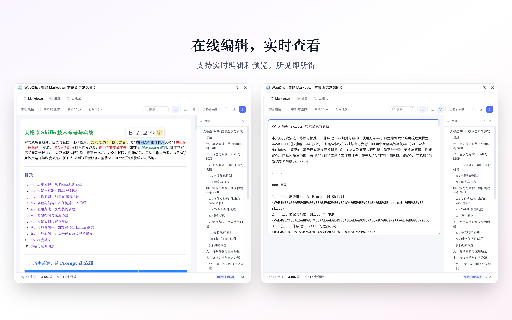
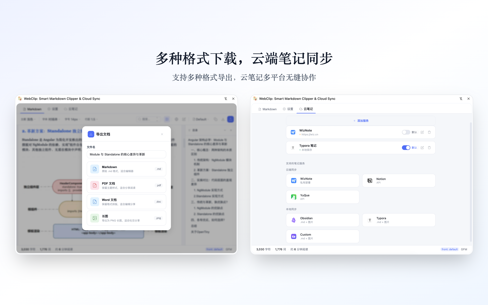

# WebClip : 智能 Markdown 剪藏 & 云笔记同步

  

> 一键去标签广告，智能转 Markdown。支持自定义主题、目录导航、搜索跳转、高亮编辑。支持 30+ 主流社区及 AI 平台。

[English](./README.md) | 简体中文

---

## 功能特性

### 智能文本提取

基于 AI 算法精准识别正文，自动过滤广告、推荐、评论、标签等噪声。深度优化代码块提取，完美保留语法高亮和语言类型。

  

### 个性化阅读体验

4 种精美主题（浅色、GitHub、暖纸、深色），3 种字体，可调字号/行距，保护视力舒适阅读。

  

### 高效导航

自动生成文章目录，支持章节快速跳转。全文搜索高亮定位，秒速找到关键内容。目录支持折叠展开。

  

### 在线编辑

实时 Markdown 编辑与即时预览。一键导出多种格式。

  

### 多端云笔记同步

无缝集成为知笔记、Notion、语雀、Obsidian、Typora 等。多格式导出：Markdown、PDF、Word、长图。

  

---

## 支持平台

支持 30+ 主流技术社区、开发者平台及 AI 对话平台，涵盖国内外主流服务。

---

## 快速开始

### 安装

**Chrome Web Store / Edge Add-ons（推荐）**

1. 访问 [Chrome Web Store](https://chrome.google.com/webstore/detail/webclip) 或 [Edge Add-ons](https://microsoftedge.microsoft.com/addons/detail/webclip)
2. 搜索 "WebClip"
3. 点击安装

### 使用方法

1. 点击浏览器工具栏的 WebClip 图标
2. 当前网页内容将自动提取并转换为 Markdown
3. 在侧边栏中编辑、预览和调整格式
4. 一键复制或保存到云笔记

---

## 隐私保护

- 所有处理在本地完成，不上传到任何服务器
- 不收集浏览历史或个人身份信息
- 云同步仅在用户主动授权后进行
- 详见 [隐私政策](./docs/PRIVACY.md)

---

## 更新日志

### v2.1.5 (2026-04-16)

- 上线 WebClip Pro 付费体系（买断版 / 年付版）
- License 激活与设备管理
- 落地页重设计 + 紧凑化定价卡片
- 修复：发布包缺少 `pro-license.js` 导致升级按钮消失、侧边栏卡在加载

### v2.1.3 (2026-03-26)

- 新增 AI 对话平台抓取支持（ChatGPT、Claude.ai、Gemini、豆包、Kimi、DeepSeek、Qwen）
- 新增 Reddit 评论区完整抓取
- PDF 导出黑屏修复
- 国际站点兼容优化（Dev.to、Hashnode、Substack）

### v2.1.2 (2026-03-23)

- 多格式导出：Markdown、PDF、Word、长图
- PDF 智能分页
- Word 导出支持
- 长图 Retina 分辨率导出

### v2.1.1 (2026-03-23)

- 多云笔记服务支持
- 本地 ZIP 打包同步
- 服务适配器模式
- UI 重构

### v2.1.0 (2026-03-22)

- 安全加固：修复 XSS 漏洞
- 性能优化
- 目录功能改进
- 云笔记功能增强
- 搜索功能增强

### v2.0.0 (2026-03-18)

- 全新插件化预处理器架构
- 云厂商文档支持
- 4 主题 3 字体 UI 优化
- 云同步支持

---

## 贡献

欢迎提交 Issues 和 Pull Requests。

- [GitHub Issues](https://github.com/damoncui668/webclip/issues)

## 许可证

- [MIT License](./LICENSE)

---

## 支持作者

如果 WebClip 对你有帮助，欢迎请我喝杯咖啡，支持持续开发！

  <table>
    <tr>
      <td align="center">
        
         
        微信支付
      </td>
      <td align="center">
        
         
        支付宝
      </td>
    </tr>
  </table>

---

让 WebClip 成为你的知识管理助手，轻松构建个人知识库！
